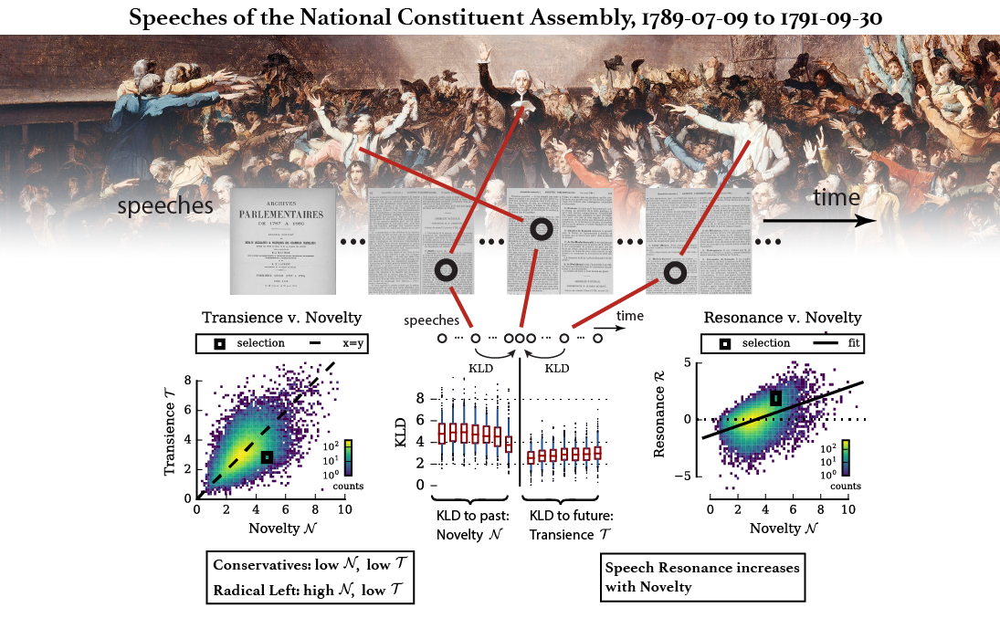

# FRevNCA_CuratedData

Curated and augmented data for 44,953 legislative speeches from the National Constituent Assembly during the French Revolution.  Companion to PNAS article [Individuals, institutions, and innovation in the debates of the French Revolution](https://www.pnas.org/content/115/18/4607.short) by Alexander T. J. Barron, Jenny Huang, Rebecca L. Spang, and Simon DeDeo.



## Overview

This corpus was partially created from the [French Revolution Digital Archive](https://frda.stanford.edu/) (FRDA), a digitization of the Archives Parlementaires (AP) made available through the efforts of Stanford University Libraries and the Bibliothèque nationale de France.  This data contains the FRDA's OCR-generated text from a subset of speeches made during the National Constituent Assembly, the first legislative body of the French Revolution.  Each speech is augmented with date correction, speaker disambiguation, legislative role markers, political affiliation, and class membership.  See the [column guide](#column-guide) for more detail.  Also provided is the topic model trained from these speeches and used in the PNAS article.

This data set is made publicly available as a resource for education and
further research.  If you find it useful, we'd love to hear from you at
atbarron [at] iu [dot] edu!  Also, please cite this work as the following:

Alexander T. J. Barron, Jenny Huang, Rebecca L. Spang, and Simon DeDeo, "Individuals, institutions, and innovation in the debates of the French Revolution," _PNAS_, vol. 115, pp. 4607–4612, May 2018.

```
@article {BarronFRev,
	author = {Barron, Alexander T. J. and Huang, Jenny and Spang, Rebecca L. and DeDeo, Simon},
	title = {Individuals, institutions, and innovation in the debates of the French Revolution},
	volume = {115},
	number = {18},
	pages = {4607--4612},
	year = {2018},
	doi = {10.1073/pnas.1717729115},
	publisher = {National Academy of Sciences},
	URL = {https://www.pnas.org/content/115/18/4607},
	journal = {Proceedings of the National Academy of Sciences}
}
```

## Files

See `FRevNCA_CuratedData.ipynb` for details on each file below.

* `FRevNCA_speechdata.txt.gz`: contains raw and processed speech text, speaker information, and metadata.  utf-8 encoded, with '=+=' column delimiters and newline row delimiters, gzipped with level 9 compression.
* `FRevNCA_ProcessedVocabText_topics.gz`: topics trained from speech data via Latent Dirichlet Allocation.
* `FRevNCA_ProcessedVocabText_topicmixtures.gz`: topic mixtures associated with the topics above
* `FRevNCA_ProcessedVocabText_vocabbasis.txt.gz`: vocabulary basis for the topics

## Notebooks

* `FRevNCA_CuratedData.ipynb`: loads and describes data.

## Column guide:

These are a curated and augmented subset of data obtained originally from the publicly available xml files posted on Stanford's FRDA website, retrieved for this work circa ~2015. The FRDA web interface has changed since then, but metadata relevant to the original xml remains for completeness.

* `NCASpeechId`: universal speech index used for all data.
* `Date`: date of the speech.  These were cleaned and corrected from the original, which had errors in order and in formatting.
* `OrigFile`: original xml file.
* `Volume`: original volume of the AP.
* `PbTagId`: location id used throughout the original xml, useful for old FRDA web interface or working with original xml files.  The speech falls after this PbTagId and before the next, in AP page order.
* `PageNum`: page of the AP on which the speech occurs.
* `SpeakerStr`: speaker string provided by the FRDA xml.
* `Surname` and `Name`: identities disambiguated from all the SpeakerStrs.  These are the ones used in the PNAS analysis.  Note: although a lot of manual attention produced these attributions, they are not guaranteed 100% accurate!  There was significant noise in the SpeakerStr data - see the [Supplementary Material](https://www.pnas.org/content/suppl/2018/04/16/1717729115.DCSupplemental), _Preparing and characterizing speech data_ section, for more detail. "nomatch" indicates the speech's `SpeakerStr` was not assigned to a disambiguated entity.
* `Affiliation`: "g" (gauche), "d" (droite), "nonpos" (matched identity isn't positively identified as gauche or droite according to our historian co-author), or "nomatch" (no identity match was made to `SpeakerStr`).
* `Estate`, 1st/2nd/3rd estate, or "nonpos"/"nomatch" as for `Affiliation`.
* `Club`: an assortment of political clubs to which individuals belonged, or "nonpos"/"nomatch".
* `President`: binary presidential speech indicator.
* `CommitteeStatus`: "newitem" (speaker as committee proxy introduces a decree proposal to the floor), "indebate" (committee proxy speaks in the midst of debate), or "noncomm" (speaker is not a committee proxy).
* `RawTextFr`: The raw speech text obtained from the original xml.
* `RawTextEnTrans`: For giggles, I made a script circa ~2016 that queries Google Translate with all of the raw speeches.  Results included here.
* `ProcessedText`: `RawTextFr` after light tokenization.
* `ProcessedVocabText`: `ProcessedText` after removing words with fewer than 3 characters, stop words, then limiting to a 10,000-word vocabulary by highest observed frequency.

## Requirements (versions used)

* python (3.7.10)
* numpy (1.18.5)
* pandas (1.3.5)
